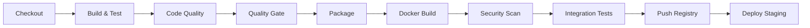

# Observability Demo Application

A comprehensive Spring Boot application demonstrating full observability stack integration with **Grafana Cloud**, **Loki**, **Tempo**, and **Prometheus**. This project includes a complete **CI/CD pipeline** using **Jenkins**, **SonarQube**, **Trivy**, and **Docker**.

## 🚀 Features

### Observability Stack
- **Metrics**: Micrometer with Prometheus integration
- **Logging**: Structured JSON logging with Loki integration
- **Tracing**: OpenTelemetry with Tempo integration
- **Dashboards**: Pre-configured Grafana dashboards
- **Alerting**: Ready for Grafana Cloud alerting setup

### CI/CD Pipeline
- **Jenkins Pipeline**: Comprehensive pipeline as code
- **Code Quality**: SonarQube analysis with quality gates
- **Security Scanning**: Trivy container vulnerability scanning
- **Docker**: Multi-stage builds with security best practices
- **Testing**: Unit tests, integration tests, and coverage reporting

### Application Features
- REST API with instrumented endpoints
- Health checks and metrics endpoints
- Simulated slow operations and errors for demonstration
- Custom metrics and tracing examples

## 🏗️ Architecture

```
┌─────────────────┐    ┌─────────────────┐    ┌─────────────────┐
│   Application   │───▶│   Grafana       │───▶│   Grafana       │
│   (Spring Boot) │    │   Local Stack   │    │   Cloud         │
└─────────────────┘    └─────────────────┘    └─────────────────┘
         │                       │                       │
         ├─ Metrics ─────────────┼─ Prometheus ──────────┼─ Metrics
         ├─ Logs ────────────────┼─ Loki ────────────────┼─ Logs  
         └─ Traces ──────────────┼─ Tempo ───────────────┼─ Traces
                                 │                       │
┌─────────────────┐              │              ┌─────────────────┐
│   CI/CD         │              │              │   Monitoring    │
│   (Jenkins)     │──────────────┘              │   & Alerting    │
│                 │                             │   (Grafana)     │
│ ├─ SonarQube    │                             └─────────────────┘
│ ├─ Trivy        │
│ └─ Docker       │
└─────────────────┘
```

## 📋 Prerequisites

### Local Development
- **Java 17** or higher
- **Maven 3.6+**
- **Docker** and **Docker Compose**
- **Git**

### CI/CD Setup
- **Jenkins** with required plugins
- **SonarQube** server (SonarCloud or self-hosted)
- **Docker Registry** access

### Grafana Cloud (Optional)
- Grafana Cloud account
- API keys for Prometheus, Loki, and Tempo

## 🚀 Quick Start

### 1. Clone the Repository

```bash
git clone <repository-url>
cd observability-demo-app
```

### 2. Local Development Setup

#### Run with Local Observability Stack

```bash
# Start the complete observability stack
docker-compose up -d

# Build and run the application
./mvnw spring-boot:run
```

#### Access Local Services

- **Application**: http://localhost:8080
- **Grafana**: http://localhost:3000 (admin/admin)
- **Prometheus**: http://localhost:9090
- **Loki**: http://localhost:3100

### 3. Test the Application

```bash
# Health check
curl http://localhost:8080/api/demo/health

# Create a user
curl -X POST http://localhost:8080/api/demo/users \
  -H "Content-Type: application/json" \
  -d '{"name": "John Doe", "email": "john@example.com"}'

# Get user (will return 404 for random ID)
curl http://localhost:8080/api/demo/users/123

# Slow endpoint (simulates latency)
curl http://localhost:8080/api/demo/slow

# Error endpoint (randomly fails)
curl http://localhost:8080/api/demo/error

# Custom metrics
curl http://localhost:8080/api/demo/metrics

# Prometheus metrics
curl http://localhost:8080/actuator/prometheus
```

## 🔧 Configuration

### Environment Variables

Copy `.env.example` to `.env` and configure:

```bash
cp .env.example .env
```

Key configuration options:

```bash
# Grafana Cloud Configuration
GRAFANA_CLOUD_PROMETHEUS_URL=https://prometheus-prod-01-eu-west-0.grafana.net/api/prom/push
GRAFANA_CLOUD_LOKI_URL=https://logs-prod-eu-west-0.grafana.net/loki/api/v1/push
GRAFANA_CLOUD_TEMPO_URL=https://tempo-eu-west-0.grafana.net:443
GRAFANA_CLOUD_API_KEY=your-base64-encoded-credentials

# Application Profile
SPRING_PROFILES_ACTIVE=prod  # or local, dev
```

### Grafana Cloud Setup

1. **Create Grafana Cloud Account**
   - Sign up at https://grafana.com/products/cloud/

2. **Get API Keys**
   - Navigate to your stack
   - Go to "Security" → "API Keys"
   - Create keys for Prometheus, Loki, and Tempo

3. **Encode Credentials**
   ```bash
   # Format: username:api_key
   echo -n "your_user_id:your_api_key" | base64
   ```

4. **Update Configuration**
   - Update `.env` with your Grafana Cloud URLs and API key
   - Use production profile: `SPRING_PROFILES_ACTIVE=prod`

## 🔄 CI/CD Pipeline

### Jenkins Setup

1. **Install Required Plugins**
   - Pipeline Plugin
   - SonarQube Scanner Plugin
   - Docker Plugin
   - HTML Publisher Plugin
   - Email Extension Plugin

2. **Configure Global Tools**
   - **JDK**: Name `JDK-17`, Java 17 installation
   - **Maven**: Name `Maven-3.9.5`, Maven 3.9.5 installation

3. **Configure Integrations**
   - **SonarQube**: Add server configuration
   - **Docker Registry**: Add credentials
   - **Email**: Configure SMTP settings

4. **Create Pipeline Job**
   - New Item → Pipeline
   - SCM: Git with your repository
   - Script Path: `Jenkinsfile`

### Pipeline Stages



See `jenkins/pipeline-config.md` for detailed setup instructions.

## 📊 Observability Features

### Metrics

The application exposes various metrics:

- **Custom Business Metrics**
  - `demo_health_requests_total`: Health check counter
  - `demo_user_requests_total`: User API requests
  - `demo_errors_total`: Error occurrences
  - `demo_slow_processing_time`: Processing time histogram

- **Spring Boot Metrics**
  - HTTP request metrics
  - JVM metrics
  - Database connection metrics
  - Custom application metrics

### Logging

Structured JSON logging with:

- **Correlation IDs**: Trace requests across services
- **Contextual Information**: User ID, request ID, etc.
- **Log Levels**: Configurable per package
- **Loki Integration**: Automatic log aggregation

Example log entry:
```json
{
  "timestamp": "2024-01-15T10:30:00.000Z",
  "level": "INFO",
  "logger": "com.demo.observability.controller.DemoController",
  "message": "Getting user with ID: 123",
  "traceId": "abc123",
  "spanId": "def456",
  "requestId": "req-789",
  "userId": "123"
}
```

### Tracing

OpenTelemetry integration provides:

- **Distributed Tracing**: End-to-end request tracing
- **Custom Spans**: Business logic instrumentation
- **Automatic Instrumentation**: HTTP, database calls
- **Tempo Integration**: Trace storage and querying

### Dashboards

Pre-configured Grafana dashboards available:

1. **Application Overview**
   - Request rate, response time, error rate
   - JVM metrics, memory usage
   - Custom business metrics

2. **Performance Monitoring**
   - Response time percentiles
   - Slow endpoint analysis
   - Database performance

3. **Error Analysis**
   - Error rate trends
   - Error classification
   - Stack trace analysis

4. **Infrastructure Monitoring**
   - Container metrics
   - Resource utilization
   - Health status

## 🔒 Security Features

### Container Security

- **Multi-stage Docker builds**: Smaller attack surface
- **Non-root user**: Security best practices
- **Trivy scanning**: Vulnerability detection
- **Hadolint**: Dockerfile best practices

### Application Security

- **OWASP Dependency Check**: Dependency vulnerability scanning
- **SonarQube**: Security hotspot detection
- **Secure configurations**: Production-ready settings

### CI/CD Security

- **Quality Gates**: Automated security checks
- **Vulnerability Thresholds**: Fail builds on critical issues
- **Dependency Updates**: Regular security updates

## 🛠️ Development

### Running Tests

```bash
# Unit tests
./mvnw test

# Integration tests
./mvnw verify

# Coverage report
./mvnw jacoco:report
```

### Code Quality

```bash
# SonarQube analysis (requires SonarQube server)
./mvnw sonar:sonar

# OWASP dependency check
./mvnw org.owasp:dependency-check-maven:check
```

### Docker Development

```bash
# Build image
docker build -t observability-demo .

# Run container
docker run -p 8080:8080 observability-demo

# Run with environment variables
docker run -p 8080:8080 \
  -e SPRING_PROFILES_ACTIVE=prod \
  -e GRAFANA_CLOUD_API_KEY=your-key \
  observability-demo
```

## 📈 Monitoring Best Practices

### Metrics to Monitor

1. **Golden Signals**
   - **Latency**: Response time percentiles
   - **Traffic**: Request rate
   - **Errors**: Error rate and types
   - **Saturation**: Resource utilization

2. **Business Metrics**
   - User registrations
   - Feature usage
   - Business process success rates

3. **Infrastructure Metrics**
   - CPU, memory, disk usage
   - Container health
   - Network performance

### Alerting Setup

1. **Critical Alerts**
   - Service unavailability
   - High error rates (>5%)
   - Response time degradation (>95th percentile)

2. **Warning Alerts**
   - Memory usage >80%
   - Disk space <20%
   - Dependency failures

3. **Business Alerts**
   - Registration failures
   - Payment processing issues
   - SLA violations

## 🚀 Deployment

### Production Deployment

1. **Environment Setup**
   ```bash
   # Set production environment
   export SPRING_PROFILES_ACTIVE=prod
   export GRAFANA_CLOUD_API_KEY=your-encoded-key
   ```

2. **Database Migration**
   ```bash
   # Run database migrations
   ./mvnw flyway:migrate
   ```

3. **Deploy Application**
   ```bash
   # Kubernetes deployment
   kubectl apply -f k8s/

   # Docker Compose deployment
   docker-compose -f docker-compose.prod.yml up -d
   ```

### Kubernetes Deployment

Example Kubernetes manifests:

```yaml
apiVersion: apps/v1
kind: Deployment
metadata:
  name: observability-demo
spec:
  replicas: 3
  selector:
    matchLabels:
      app: observability-demo
  template:
    spec:
      containers:
      - name: app
        image: your-registry/observability-demo:latest
        env:
        - name: SPRING_PROFILES_ACTIVE
          value: "prod"
        - name: GRAFANA_CLOUD_API_KEY
          valueFrom:
            secretKeyRef:
              name: grafana-cloud-secret
              key: api-key
```

## 📚 Additional Resources

### Documentation
- [Spring Boot Actuator](https://docs.spring.io/spring-boot/docs/current/reference/html/actuator.html)
- [Micrometer Documentation](https://micrometer.io/docs)
- [OpenTelemetry Java](https://opentelemetry.io/docs/instrumentation/java/)
- [Grafana Cloud Documentation](https://grafana.com/docs/grafana-cloud/)

### Tools and Plugins
- [Jenkins Pipeline Documentation](https://www.jenkins.io/doc/book/pipeline/)
- [SonarQube Documentation](https://docs.sonarqube.org/)
- [Trivy Documentation](https://aquasecurity.github.io/trivy/)

## 🤝 Contributing

1. **Fork the repository**
2. **Create feature branch**: `git checkout -b feature/amazing-feature`
3. **Commit changes**: `git commit -m 'Add amazing feature'`
4. **Push to branch**: `git push origin feature/amazing-feature`
5. **Open Pull Request**

### Development Guidelines

- Follow Spring Boot best practices
- Add tests for new features
- Update documentation
- Ensure CI/CD pipeline passes
- Add observability instrumentation

## 📄 License

This project is licensed under the MIT License - see the [LICENSE](LICENSE) file for details.

## 🆘 Support

- **Issues**: [GitHub Issues](https://github.com/your-repo/issues)
- **Discussions**: [GitHub Discussions](https://github.com/your-repo/discussions)
- **Documentation**: Check the `docs/` directory

---

**Happy Observing! 📊🔍**
# observability-demo-app
